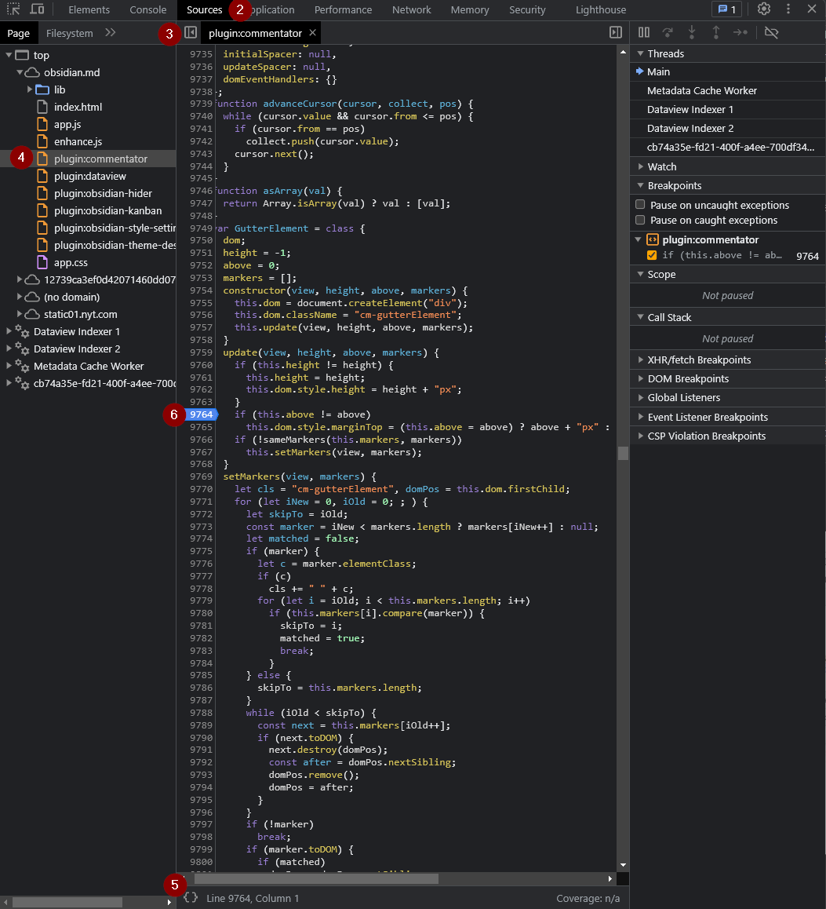
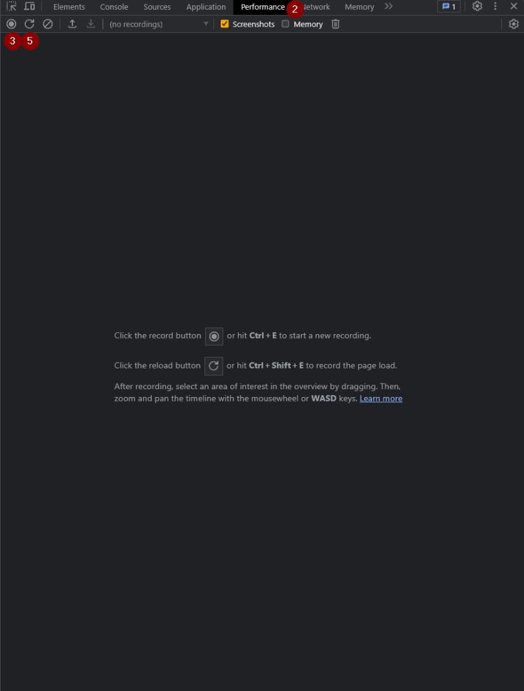
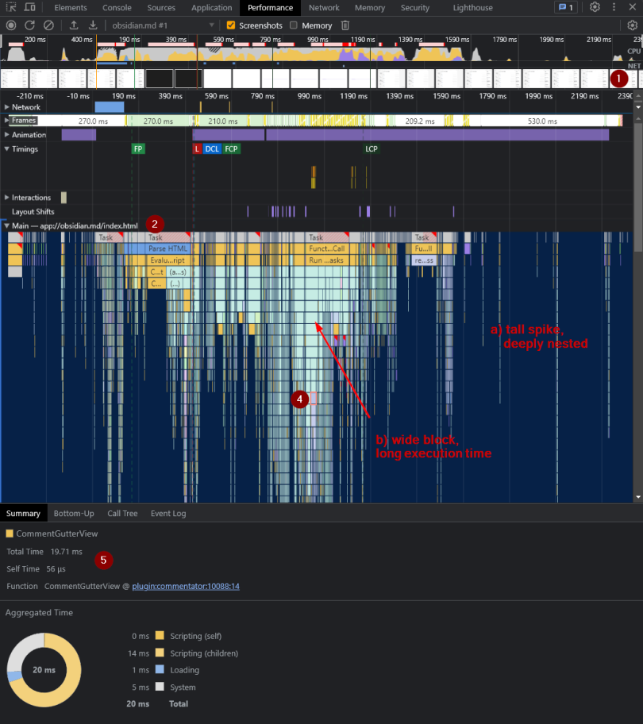
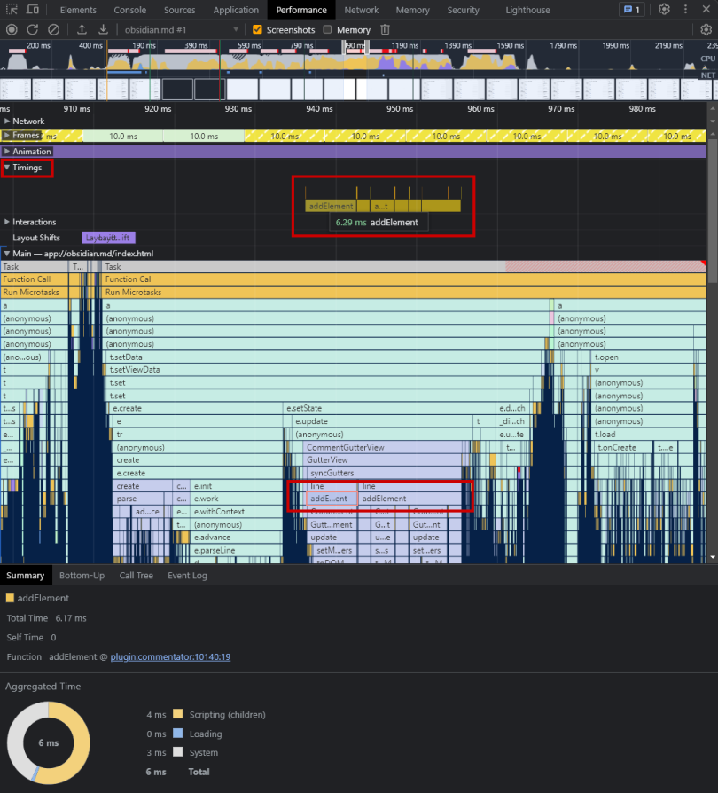
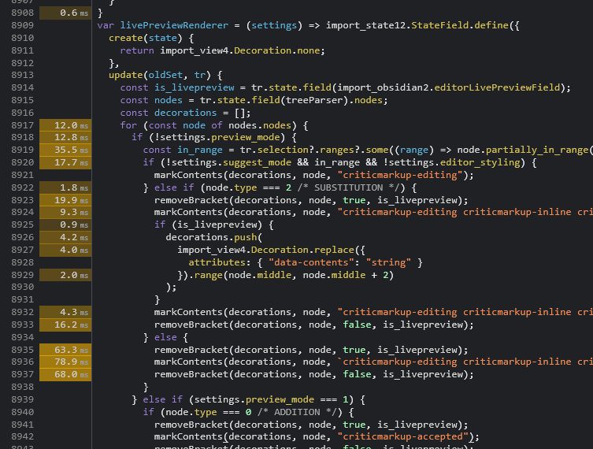

## Debugging your code
### Unwinding the code trace
Sometimes you want to figure out what path your code takes when getting executed. This may be helpful for investigating inconsistent behaviour between function calls or finding where exactly in the bundled/minified code your function is located
```ts
// Logs the current stack trace of the code, also logs any provided parameters

/*
 * YOUR CODE HERE
 */
console.trace(var1, var2);
```

### Breakpoints
Like IDE's, the Chrome Devtools provide a way to break and pause on certain lines of code. Here's how you can do that:
1. Open the Developer Tools (`Ctrl + Shift + I`)
2. Go to the `Sources` tab
3. Reveal the left bar (if not hidden)
4. Select your plugin's code under `top > obsidian.md > plugin:XXX`
5. `Pretty format` if code is all on one line
6. Click the line number to set a breakpoint on that line
7. Run your code to start the debugger



Note: from any `console.log`/`console.trace` in the console, you can directly jump to the location in the transpiled file

Alternatively, you can also programmatically add a breakpoint via:
```ts
function yourFunction() {
  // YOUR CODE HERE
  debugger; // Acts as a breakpoint
}
```

### Debugging
If you have a breakpoint and your code gets executed, the debugger should normally get paused. Here are some things you can do in this state:
1. Step to next line (`F10`)
2. Step into the function (`F11`) or out of the function (`Shift + F11)`
3. Continue code execution until the next breakpoint (`F8`)
4. View values defined in current `Scope` and parameters
5. View current `Call Stack`
6. Go to the `Console` tab, you can test and play around with the values in the current scope


## Investigating performance of your code

### Timing your code
Say you want to see how long it takes for your code to run, instead of messing about with `Date.now()` and then logging it, you can use the built-in commands of the [`console API`](<https://developer.mozilla.org/en-US/docs/Web/API/console>):

```ts
// Measures execution time of code and logs it into console

console.time('label');
/*
 * YOUR HEAVY CODE HERE
 */
console.timeEnd('label');
```

### Flame Charts (🔥📈)
If you want *more* information about your code, try generating a flame chart. It displays all fired events, executed functions and visualizes the stack traces of the program (including separate threads held by webworkers).

Generating and displaying a flamechart:
1. Open the Developer Tools (`Ctrl + Shift + I`)
2. Go to the `Performance` tab (may be hidden behind the arrows)
3. Press the `Record` button or `Ctrl + E` (leftmost button, under the devtools tabs)
4. Execute your code (be it command, rendering, ...)
*(if your code only runs on app/plugin start-up, you can run the `Reload app without saving` command without the capture stopping - create a shortcut to this action for convenience)*
5. Stop the recording with the same button or `Ctrl + E`
6. Wait for the graph to render


### Using the Flame Chart
There's a lot of information contained within the `Performance` capture, here are some important elements:
1. If the `Screenshots` option (see top bar) is enabled, you can hover over the images to view the exact look of the app at that moment in time
2. Under `Main`, you can see all the functions that are being executed on the main thread over time.
a) Tall spikes indicate a large amount of function calls (deeply nested)
b) Wide blocks indicate a **long execution times**
3. Zoom into the graph to narrow the time interval
4. Click on a block in the graph
5. ...to view information about how it was executed


### Adding markings to the Flame Chart
Flame charts are fantastic tools and all, but it can get quite tricky to find where and when your code is being executed - especially with dozens of other plugins running their code concurrently.

Luckily, the [`performance API`](<https://developer.mozilla.org/en-US/docs/Web/API/Performance_API/Performance_data>) provides a couple methods that will add markings to the graph, under `Timings`

```ts
// Measures execution time of code and marks it in the Performance flamechart under 'Timings'

performance.mark('start');
// YOUR HEAVY CODE HERE
performance.mark('end');
const code_perf = performance.measure('label', 'start', 'end');
// can be used computing averages and logged
```


### Interpreting your flame chart
As mentioned before, **wide** blocks are the root cause of bad performance. In the example I show (my plugin), it takes 20ms to execute a render function (as indicated by the `Total Time` given in the `Summary`.

With the chart, you can easily scroll down the flame chart (or look at the `Call Tree`) to see why exactly the function is performing poorly. In my case, I notice that a significant amount of time is being spent on running the `MarkdownRenderer.render` function.

Finally, having detected the performance hog, you can either take steps to either reduce its usage and make sure it gets called as little as possible, or write a more efficient function.


### Extra tips
When you have a `Performance Snapshot`, you can go to to the `Sources` tab that now places a duration in milliseconds next to (some) code lines, which can give an indication of how long it took to execute a particular line/function
(NOTE: it isn't exactly documented anywhere what this duration represents)

